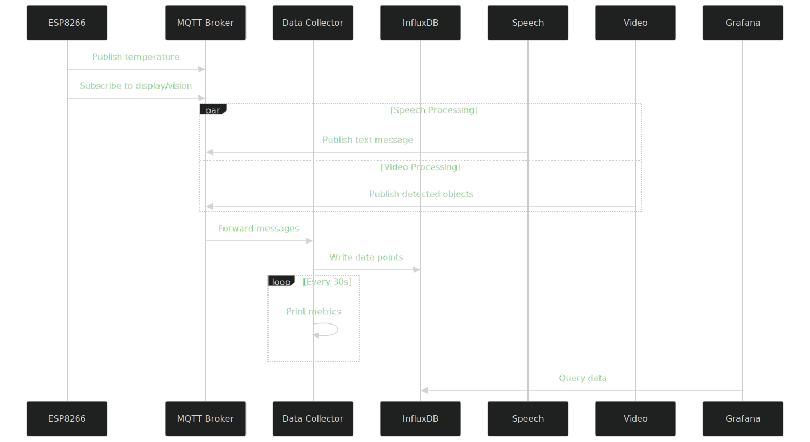

# IoT and Video Analysis Framework

## Authors: Daniil Khabichau, Mikhail Skrobat


## Overview
This repository contains three Python scripts designed for IoT integration and real-time data analysis:

1. `speech_processor.py`: Real-time audio transcription using Whisper and MQTT integration.
2. `subscriber.py`: Processes IoT sensor data via MQTT and stores it in InfluxDB.
3. `object_detection_analyzer.py`: Real-time object detection using YOLOv8 and MQTT for data publishing.

---

## File Descriptions

### speech_processor.py
- Purpose: Captures audio in real-time, transcribes it using Whisper, and publishes the transcription to an MQTT topic.
- Features:
  - Audio input handling with silence detection.
  - Uses OpenAI's Whisper for Polish-language transcription.
  - Publishes results as JSON to the MQTT topic iot/display/message.
- Highlights:
  - Configurable audio settings: 16kHz sample rate, 5-second buffer.
  - Supports CPU and GPU (CUDA) for computation.

---

### subscriber.py
- Purpose: Subscribes to IoT MQTT topics, processes sensor data, and stores it in InfluxDB.
- Features:
  - Processes temperature, display, and vision data.
  - Writes processed data into InfluxDB for further analysis.
  - Tracks and logs key performance metrics, including message counts and database writes.
- Highlights:
  - Subscribes to MQTT topics like iot/sensor/temp, iot/display/message, and iot/vision/detect.
  - Handles disconnection and reconnection to the MQTT broker.

---

### video_to_text.py
- Purpose: Detects objects in real-time video streams using YOLOv8 and publishes object data to MQTT.
- Features:
  - Performs object detection using the YOLOv8 model (yolov8n.pt by default).
  - Publishes detected object counts (e.g., { "person": 2, "car": 1 }) to the MQTT topic iot/vision/detect.
  - Tracks performance metrics (e.g., FPS).
  - Displays bounding boxes, labels, and FPS on the video feed.
- Highlights:
  - Assigns unique colors for each detected class.
  - Configurable detection confidence threshold (default: 0.5).
  - Supports secure MQTT communication with TLS.

---

## Directory Structure

```plaintext
IOT-main
├── idea
├── venv
├── grafana
├── logs
├── models
├── gitignore
├── docker-compose
├── Dockerfile
├── emqxsi-ca
├── esp8266
├── Readme
├── requirements
├── speech_processor
├── subscriber
├── video_to_text
└── yolov8n.pt
```


# Diagrams

## System Architecture


## Data Flow


## Docker Components



